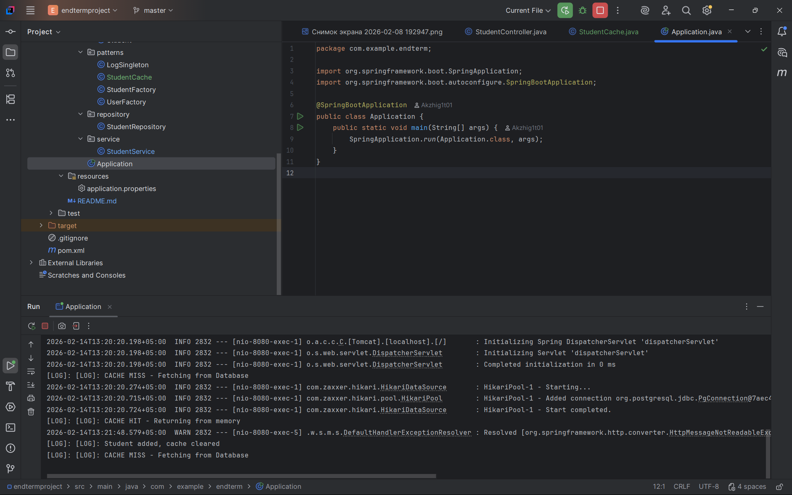

Student Management System - Project Report 

Project Goal

The goal of this project was to build a backend system for student management using Spring Boot and PostgreSQL, while correctly implementing design patterns like Singleton and Factory.

How it's built

I used a layered architecture to keep the code clean:

Controller: Handles incoming API requests.

Service: Where the main logic happens (and where I used the Singleton).

Repository: Raw JDBC code to talk to PostgreSQL.

Model: The data structure for a Student.

Applied Design Patterns

Singleton (LogSingleton): I created this class to make sure we only have one logger instance throughout the whole app. It prevents creating unnecessary objects and keeps all console logs in one style.

Factory (StudentFactory): This class is responsible for creating Student objects. Instead of calling new Student() everywhere, I use the factory. Inside, it uses a Builder to set up the fields (name, email, age) step-by-step.

Database Schema

The project uses a simple PostgreSQL table:

CREATE TABLE students (

id SERIAL PRIMARY KEY,

name VARCHAR(100) NOT NULL,

email VARCHAR(100) UNIQUE,

age INT
);

How to verify the work

Launch the app: Run Application.java in IntelliJ.

Check API: Go to http://localhost:8080/api/students in your browser. You should see a JSON list of students.

Check Logs: Look at the IDEA console. You will see lines starting with [LOG] — this is the Singleton in action.

Project Structure

controller/ — StudentController.java

model/ — Student.java

patterns/ — StudentFactory.java, LogSingleton.java

repository/ — StudentRepository.java

service/ — StudentService.java

Bonus Task: In-Memory Caching Layer

The main goal of this task was to boost the application's performance. I implemented a simple in-memory caching mechanism to handle frequently accessed data more efficiently.

How I built it:
I used the Singleton pattern for the StudentCache class to make sure there’s only one cache instance running across the whole app. For storage, I went with a ConcurrentHashMap using a Key-Value structure, where the key is the request type and the value is the list of students. To keep the data consistent, I set up an invalidation rule: whenever the createStudent method is called, the cache clears itself automatically. This way, we don't end up showing outdated information after a new student is added.

How to verify:
First, go to http://localhost:8080/api/students. The first time, it pulls data from the database, and you’ll see "[LOG]: CACHE MISS" in the console. If you refresh the page, the data loads instantly from memory, and the log will show "[LOG]: CACHE HIT." If you add a new student, the log will say the cache is cleared, and the next request will be a miss again while it updates.

Design Principles:
I followed SOLID principles here. The StudentCache class has a Single Responsibility—it only manages data storage and retrieval. Also, because of the layered architecture, all the caching logic is tucked away in the Service layer, so it doesn't mess with the Controller or Repository logic.

